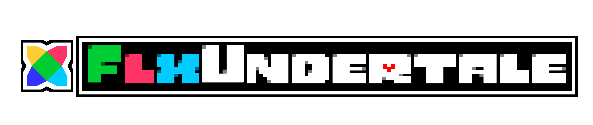
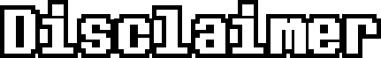
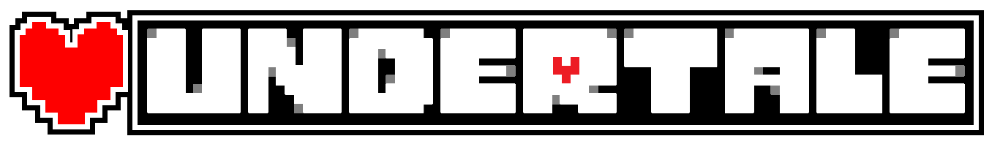
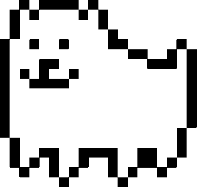
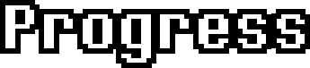
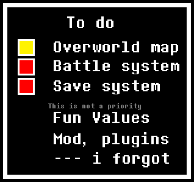

<center>
  
</center>

**FlxUndertale** is a framework for making **Undertale**-style mods and fangames, written 100% in **Haxe** — _at least I think so!_ 😅

It was originally made for my fangame **"Undertale: BoundFate"**, but later I moved that project to another engine (I'm autistic and got overwhelmed by the code at the time).  
The goal of **FlxUndertale** is to make it easier to create maps, dialogue systems, and combat mechanics inspired by Undertale, in a simple and modular way.

Currently, the framework supports:

- Map creation using [OGMO Editor]() _(for now!)_
- Scripting with **Lua**
- Basic Overworld movement/collisions

You can follow updates and chat about the project in the [Haxe Discord server](https://discord.gg/pWxqJrfXNW)!

---

## 

All **assets** used belong to **Toby Fox** and his game **Undertale**.  
I do not own any of the sprites, sounds, or music.  
This is a **fan-made project** made just for fun.

<center>

[](https://store.steampowered.com/app/391540/Undertale/)  
❤️**Please buy Undertale on Steam to support the creator!**



</center>

Some sprites (such as the character **Niz**) belong to **[@Stephanie Digits](https://x.com/StephanieDigits)**.

---

## 

<center> 
  
</center>

Right now the project is **very WIP**.  
The Overworld works, but a rewrite is in progress before I release something stable.

---

<center> <br>  <br> <br> </center>

- Rewrite the Overworld system to be more modular
- Add full OGMO Editor support
- Implement Undertale battle system
- Improve dialogue & scripting system (Lua / JSON)
- Write official documentation & examples

---

## 🤝 Contributing

Since the project is very incomplete, **all contributions are welcome!**  
If you find bugs or want to add features:

1. **Fork** the repo
2. Create a branch (`feature/my-cool-feature`)
3. Make and test your changes
4. Open a **Pull Request**

_Please be patient if I take time to respond, I’m still learning how to manage an open-source project._

---

## Building

You’ll need:

- [Haxe](https://haxe.org/)
- [HaxeFlixel](https://haxeflixel.com/documentation/getting-started/)
- [Lime](https://lime.openfl.org/)

Then, in the project folder:

```bash
haxelib install flixel
haxelib install lime
lime test hl
```

You can replace `hl` with `windows`, `linux`, `html5`, or any other supported target. _`html5` its very buggy_

---

## License

This project is distributed under the **Apache 2.0** license _(or whatever you choose later)_.
Check the [LICENSE](LICENSE) file for details.

---
